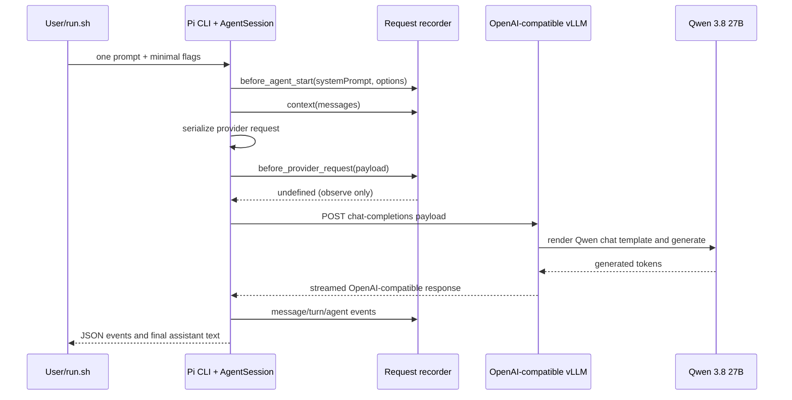

# Minimal Pi runtime

Lab 1 deliberately removes every optional input exposed by the CLI that is unnecessary for one model response. The run uses Qwen through Pi’s provider adapter while disabling tools, persistence, discovered extensions, skills, prompt templates, themes, and project context files. One explicit recorder extension remains because observation is the point of the lab.

## What each layer contributes

| Observation | Owner | Evidence in Lab 1 |
|---|---|---|
| The user prompt text | User/input layer | `context` and provider payload records |
| System instructions, current working directory, message roles, provider request shape | Pi/harness | `before_agent_start` and `before_provider_request` records; `system-prompt.js` |
| OpenAI-compatible HTTP handling and Qwen chat-template compatibility | Pi provider adapter plus vLLM | provider/model config and final payload |
| Generated reasoning/text or a decision to request a tool | Qwen | assistant stream/message records |
| Whether a requested tool can execute | Pi tool registry and policy | No tools are exposed in this lab |
| Session persistence | Pi session manager | Explicitly disabled with `--no-session` |
| Trace capture | Lab extension | `.lab-output/lab-01/*.trace.jsonl` |

The final provider payload is the nearest Pi-side observation of what vLLM receives. vLLM may then apply its configured Qwen chat template before the tensors reach the model, so the recorder does not claim to show the server’s final token IDs. Server-side request logging or a vLLM template/tokenization inspection would be needed for that last boundary.

## One turn

The CLI accepts input, runs input and pre-agent hooks, builds the system prompt, starts the agent, emits a turn, builds context, serializes a provider-specific request, streams the response, finalizes an assistant message, and settles. If tools were enabled and Qwen requested one, the agent loop could execute the tool and create another model turn. Lab 1 prevents that branch.

## Multiple turns

This particular command is ephemeral and exits after one prompt. A normal Pi session appends entries through `SessionManager`; later turns reconstruct relevant messages from that session, then context hooks and compaction can transform what is sent. Transcript, current context, and final provider payload are related but distinct artifacts.

## What Pi adds beyond a raw model API call

Even in this stripped run Pi supplies model lookup and credentials, provider compatibility, system/context construction, typed messages, streaming, lifecycle events, retries/error handling, usage accounting, and output modes. Normal Pi additionally supplies sessions, tool execution, compaction, resource discovery, extensions, and a TUI. Qwen supplies generated decisions and tokens; it does not execute tools, save sessions, enforce policy, or prove its claims.

